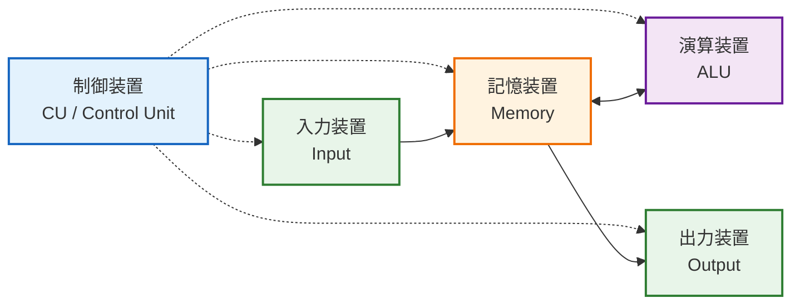
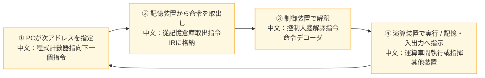
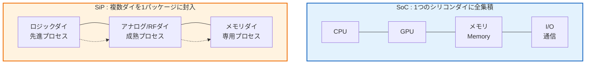
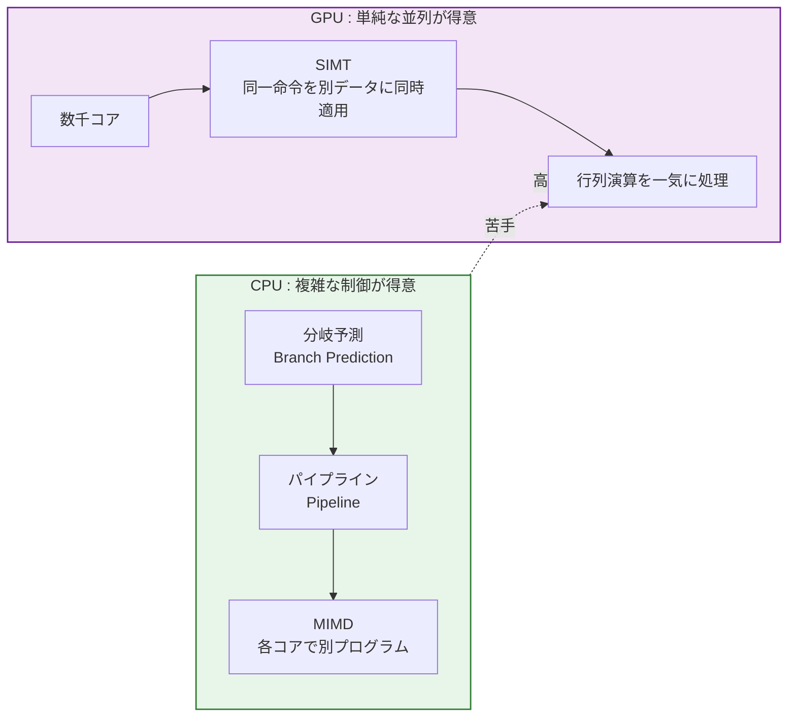
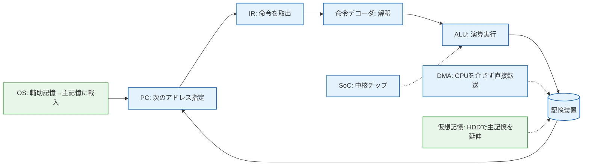

  # 1.1 コンピュータの基本構成｜五大装置

> J検 基本スキル / FE 午前 1.1 對應｜最終更新 2026-08-23
> 回到 [[總覽]] ｜ 相關單詞：[[単語本#3. コンピュータ構成要素（CPU・記憶・入出力）|単語本 - コンピュータ構成要素]]
> タグ：#FE/コンピュータ構成 #五大装置 #CPU

---

## 1. 五大装置と全体像

コンピュータは「入力・記憶・演算・制御・出力」5つの機能で構成される。
このうち **演算装置 + 制御装置 = CPU（プロセッサ）**。

| 装置 | 読み | 中文 | EN | 核心理解 |
|---|---|---|---|---|
| 入力装置 | にゅうりょく | 輸入裝置 | Input | **中文**：負責把外部世界的資訊（鍵盤敲擊、滑鼠移動）轉成電腦能處理的數位訊號。**日文**：外部のアナログ情報をデジタルデータに変換してコンピュータに渡す装置。 |
| 出力装置 | しゅつりょく | 輸出裝置 | Output | **中文**：反過來，把電腦內部的數位結果轉成人能感知的形式（螢幕顯示、列印）。**日文**：コンピュータ内部のデジタルデータを人間が認識できる形に変換して出力する装置。 |
| 記憶装置 | きおく | 記憶裝置 | Memory | **中文**：暫時存放程式和資料的倉庫，是唯一能同時與輸入、演算、輸出大量交換數據的地方。含レジスタ/キャッシュ/主記憶/補助記憶。**日文**：プログラムやデータを保持する装置。CPUが直接やり取りする中心的な倉庫。 |
| 演算装置 | えんざん | 運算裝置 | ALU | **中文**：只負責計算，四則運算、邏輯運算(AND/OR)、比較、移位都在這裡完成，不做判斷和指揮。**日文**：算術演算や論理演算、比較、シフト演算だけを担う装置。 |
| 制御装置 | せいぎょ | 控制裝置 | CU | **中文**：整台電腦的大腦，負責取出指令、解譯指令、發號施令、決定下一個指令去哪裡。**日文**：命令の取出し・解釈・他装置への指示・次命令アドレスの決定を担う司令塔。 |

### 数据流 vs 控制流

- **実線 → データの流れ**：`入力 → 記憶 ↔ 演算 → 出力`  資料在記憶和演算之間來回搬運
- **破線 - - → 制御の流れ**：`制御装置 → 入力/記憶/演算/出力`  全部由控制裝置統一指揮

> **中文**：可以想像成工廠：記憶是中央倉庫，演算是車間，控制是指揮室，輸入是進貨口，輸出是出貨口。所有貨物必經倉庫，指揮室用對講機（破線）指揮每個環節，但貨物本身（實線）不經過指揮室。
> **日文**：記憶装置を中心にデータが流れ、制御装置が全体を統制する。この関係を図で即答できることがJ検の狙い。

> 実線=データ / 破線=制御。Obsidianでこのままプレビュー表示される。元画像は `images/1.1-五大装置-図.png` に残しておく。

---

## 2. プログラムはどう実行されるか

### プログラム格納方式（プログラム内蔵方式）

**中文**：這是現代電腦的根基，1945年馮·諾依曼提出，也叫諾依曼型架構。做法是把要執行的程式先完整載入到主記憶中，CPU再用「程式計數器」逐條取出、逐條執行。只要記住兩個關鍵詞「主記憶 + 依序讀取」，就是它。
**日文**：処理すべきプログラムをあらかじめ主記憶に格納し、CPUがプログラムカウンタ(PC)で順に取り出して実行する方式。現在のコンピュータはすべてこのノイマン型。

相關概念串聯：

- **DMA制御方式 EN: Direct Memory Access / 直接記憶存取**
  **中文**：為了解決慢速I/O拖慢CPU的問題，額外加一個DMA控制器，讓I/O裝置可以繞過CPU直接和主記憶大量傳輸。CPU只需下達開始/結束命令，傳輸期間可以去做別的事。
  **日文**：入出力装置がCPUを介さずDMAコントローラ経由で主記憶と直接データ転送する方式。CPUの待ち時間を削減する。

- **仮想記憶方式 EN: Virtual Memory / 仮想記憶**
  **中文**：當程式需要的記憶體超過實體主記憶大小時，把硬碟/SSD的一部分當作記憶體的延伸來用，讓大程式也能執行。
  **日文**：補助記憶装置を主記憶の延長として使い、実メモリより大きなプログラムの実行を可能にする方式。

- **アドレス指定方式 EN: Addressing Mode**
  **中文**：不是執行方式，而是指令中如何指定操作數位址的方法（直接、間接、立即、索引等）。
  **日文**：命令が対象データのアドレスをどのように指定するかの方式。

### 命令が実行されるまでの流れ

**中文**：一條指令的生命週期固定是三步：1) 從記憶裝置取出 2) 在控制裝置解譯 3) 在演算裝置執行。記憶是倉庫（取出），控制是大腦（解譯），這個分工絕不能混。
**日文**：命令は必ず「記憶装置から取出し → 制御装置で解釈 → 演算装置で実行」。命令デコーダで解釈し、プログラムカウンタ(PC)で次アドレスを決める。

> 關鍵暫存器：**PC プログラムカウンタ**（下一個指令的地址）/ **IR 命令レジスタ**（當前指令暫存）/ **命令デコーダ**（翻譯指令）

---

## 3. システムを一つのチップ/パッケージに収める技術

### SoC - System on a Chip / システムLSI / 系統單晶片

**中文**：把原本需要多塊晶片才能組成的電腦系統（CPU、GPU、記憶體控制器、通訊模組等）全部塞進同一塊矽晶片上的技術。優點是體積極小、訊號距離極短所以速度最快、功耗最低。缺點是所有功能必須用同一製程製造，晶片面積一大，良率就急劇下降，且開發週期長、成本高。代表是手機的AP、Apple M系列。
**日文**：複数のチップで構成していたシステムを一つのシリコンダイに集積したLSI。最短配線で高性能・低消費電力・小型化を実現するが、大面積で歩留まりが低下し開発コストが高い。

### SiP - System in Package / 系統級封裝

**中文**：和SoC最容易混淆。SiP是把多個已經做好的小晶片（邏輯用先進製程、類比用成熟製程、記憶體用專用製程）一起封裝到同一個封裝殼內，從外面看像一塊晶片，但內部是多個Die。優點是開發快、可重用現有晶片、良率高（可先挑選良品KGD再封裝）、設計自由度高。缺點是晶片間的連線成為速度瓶頸。
**日文**：異なるプロセスで作られた複数のダイと受動部品を一つのパッケージに封入してシステム化する技術。開発期間が短く歩留まりに優れるが、ダイ間配線がボトルネック。

|  | SoC | SiP |
|---|---|---|
| 本質 | **1ダイに全集積** | **複数ダイを1パッケージに統合** |
| 製程 | 全功能同一製程 | 各功能最適製程可選 |
| 優勢 | 性能密度・電力效率最高 | 開發速度・良率・彈性最高 |
| 劣勢 | 大面積→良率低 | ダイ間通信稍慢 |
| 場景 | 量產大、追求極致性能時 | 快速上市、功能組合多變時 |

> **串聯記憶**：`MCU(Micro Controller Unit)` 是把CPU+記憶體+I/O做在單晶片上的微控制器（冷氣遙控器等級），可視為小規模SoC。`SoM`則是把SoC/SiP再做成一塊可插拔的模組板。

---

## 4. なぜディープラーニングはGPUなのか - CPUとの対比で理解する

**中文**：深度學習的核心是海量的矩陣乘法。GPU內部有數千個簡易核心，可以用 SIMT（單指令多線程）的方式讓所有核心同時執行同一個指令但處理不同的數據，正好對應矩陣運算的並行特性，所以速度遠超CPU。CPU則擅長處理複雜的分岐和邏輯判斷。
**日文**：ディープラーニングは大量の行列演算で成り立つ。GPUは数千コアで同一命令を異なるデータに同時適用するSIMT並列で行列演算を高速化する。

| 技術 | 中文解释 | 日文解释 | 屬於誰 |
|---|---|---|---|
| **行列演算ユニット** | 專門加速矩陣乘法的硬體，DL的本質 | 行列積を並列に高速実行するユニット | **GPU ★** |
| **分岐予測 + パイプライン** | 預測程式分岐方向，讓指令像流水線一樣重疊執行，減少等待。處理分岐多的複雜邏輯 | 分岐先を予測してパイプラインの効率を高める技術 | **CPU** |
| **浮動小数点演算ユニット(FPU)をコプロセッサとして** | 80年代外掛浮點運算晶片，現在已整合進CPU/GPU，不是GPU獨有優勢 | 昔の外付けFPUの概念、現在は内蔵済み | **歷史技術** |
| **MIMD 各コア獨立執行不同程式** | 每個核心跑不同程式、處理不同數據 | 各コアが異なるプログラムを実行 | **CPUマルチコア**，不是GPU |

> **一句話區分**：看到「行列/テンソル/並列」→ GPU；看到「分岐予測/パイプライン/MIMD」→ CPU。

---

## 5. 範例流程：從開機到執行程式（一次串聯所有單詞）

**中文**：按下電源後，OS（軟體）從輔助記憶載入主記憶 → CPU 的 **制御装置** 用 **PC** 指向第一條指令位址 → 從 **記憶装置** 取出指令到 **IR** → **命令デコーダ** 解譯 → **演算装置(ALU)** 執行 → 結果寫回 **記憶裝置** → 循環。若資料在輔助記憶，**DMA** 繞過 CPU 直接搬進主記憶；若主記憶不夠，**仮想記憶** 用硬碟補位。這整台電腦的核心晶片，就是 **SoC**（把 CPU/GPU/記憶體控制器做在同一塊矽晶片）。
**日文**：電源を入れると、OSが補助記憶から主記憶にプログラムを載せる → CPUの制御装置がPCで最初の命令アドレスを指定 → 記憶装置から命令をIRに取出 → 命令デコーダが解釈 → ALUが実行 → 結果を記憶装置に書き戻す → 繰り返し。データが補助記憶にある場合はDMAがCPUを介さず直接転送、主記憶が足りない場合は仮想記憶が HDD で補う。この中核チップが SoC。

> 背單詞時順著這個流程走一遍，每個詞的位置和作用就記起來了。

---

## 6. 重要度まとめ

- 五大装置的數據/控制流圖必須能手繪，J検每年換字母再考
- 命令的生命週期：**記憶(取出) → 制御(解釈) → 演算(実行)** 不能混
- プログラム格納方式是所有現代電腦的前提，DMA/仮想記憶是它的補充技術
- SoC = 1ダイ / SiP = 複数ダイ1パッケージ 嚴格區分
- GPU的唯一優勢是行列並行，其他選項全是CPU技術的陷阱

*出典：平成10春二種 / 平成17・18・26春FE / 令和3春・4秋AP の知識点を統合・再構成*
