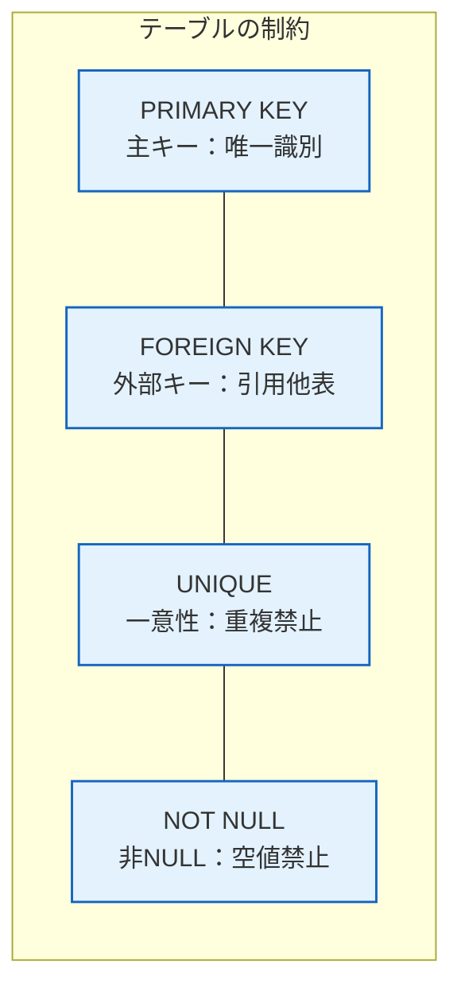

# 4.2 データベース｜SQL

> 基本情報技術者 科目A PART 4 > 4.2 SQL 對應｜最終更新 2026-10-03
> 回到 [[總覽]] ｜ 相關單詞：[[單詞本#4. データベース|單語本 - データベース]]
> タグ：#FE/データベース #SQL

---

## 1. データ定義（CREATE TABLE）

**中文**：建立資料表時，用 `CREATE TABLE` 語句定義表格結構，並可加入約束條件來確保資料正確性。
**日文**：テーブルを作成する際に `CREATE TABLE` 文で構造を定義し、制約を付けてデータの正確性を保証する。

---

## 2. 4種約束條件

| 約束 | 中文 | 日文 | 作用 |
|---|---|---|---|
| **PRIMARY KEY** | 主鍵 | 主キー | 唯一識別每一筆資料，不可重複、不可為NULL |
| **FOREIGN KEY** | 外鍵 | 外部キー | 引用其他表格的主鍵，建立表格間的關聯 |
| **UNIQUE** | 唯一約束 | 一意性制約 | 該欄位值不可重複（但可為NULL） |
| **NOT NULL** | 非空約束 | 非NULL制約 | 該欄位不可為NULL（但可重複） |

> **中文**：PRIMARY KEY = 不可重複 + 不可NULL；UNIQUE = 不可重複但可NULL；NOT NULL = 不可NULL但可重複。
> **日文**：PRIMARY KEY = 重複不可 + NULL不可；UNIQUE = 重複不可だがNULL可；NOT NULL = NULL不可だが重複可。

---

## 3. 重要度まとめ

- PRIMARY KEY：主鍵，唯一識別每一筆資料
- FOREIGN KEY：外鍵，建立表格間關聯
- UNIQUE：該欄位值不可重複
- NOT NULL：該欄位不可為NULL

*出典：科目A PART 4 > 4.2 SQL*
