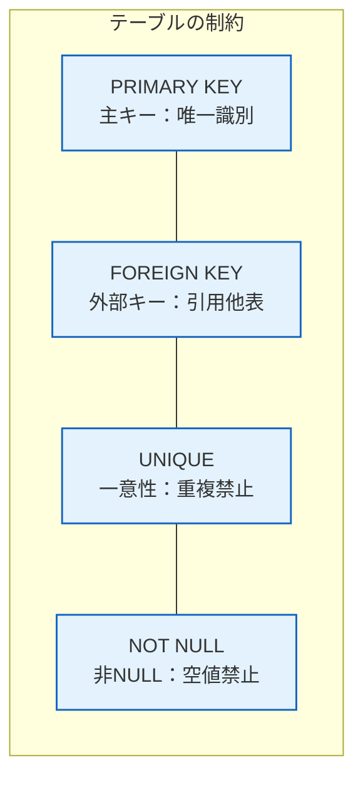

# 4.2 データベース｜SQL

> 基本情報技術者 科目A PART 4 > 4.2 SQL 對應｜最終更新 2026-10-03
> 回到 [[總覽]] ｜ 相關單詞：[[単語本#4. データベース|単語本 - データベース]]
> タグ：#FE/データベース #SQL

---

## 1. データ定義（CREATE TABLE）

**中文**：建立資料表時，用 `CREATE TABLE` 語句定義表格結構，並可加入約束條件來確保資料正確性。
**日文**：テーブルを作成する際に `CREATE TABLE` 文で構造を定義し、制約を付けてデータの正確性を保証する。

---

## 2. 4種約束條件

| 約束 | 中文 | 日文 | 作用 |
|---|---|---|---|
| **PRIMARY KEY** | 主鍵 | 主キー | 唯一識別每一筆資料，不可重複、不可為NULL |
| **FOREIGN KEY** | 外鍵 | 外部キー | 引用其他表格的主鍵，建立表格間的關聯 |
| **UNIQUE** | 唯一約束 | 一意性制約 | 該欄位值不可重複（但可為NULL） |
| **NOT NULL** | 非空約束 | 非NULL制約 | 該欄位不可為NULL（但可重複） |



> **中文**：PRIMARY KEY = 不可重複 + 不可NULL；UNIQUE = 不可重複但可NULL；NOT NULL = 不可NULL但可重複。
> **日文**：PRIMARY KEY = 重複不可 + NULL不可；UNIQUE = 重複不可だがNULL可；NOT NULL = NULL不可だが重複可。

---

## 3. データ操作（SELECT / WHERE）

**中文**：從資料表查詢資料用 `SELECT`，加上 `WHERE` 條件可以只取符合條件的資料。條件中使用比較演算子（=、>、< 等）和論理演算子（AND、OR、NOT）。
**日文**：テーブルからデータを取り出すのに `SELECT` を使い、`WHERE` 条件を付けると条件に合うデータだけを取得できる。条件には比較演算子（=、>、<など）や論理演算子（AND、OR、NOT）を使う。

```sql
SELECT 列名1, 列名2, ..., 列名n
FROM テーブル名
WHERE 列名 = 条件
```

> **中文**：`WHERE 学籍番号 = 20324` 就是「只取學號等於 20324 的資料」。
> **日文**：`WHERE 学籍番号 = 20324` は「学籍番号が20324のデータだけを取り出す」という意味。

---

## 4. 集合演算（集計関数）

**中文**：對指定欄位做統計計算的函數。`SUM` 求合計、`AVG` 求平均、`COUNT` 算筆數、`MAX` 取最大值、`MIN` 取最小值。`COUNT(*)` 表示計算全部資料列數。
**日文**：指定した列の値に対して集計計算を行う関数。`SUM`は合計、`AVG`は平均、`COUNT`は行数、`MAX`は最大値、`MIN`は最小値を求める。`COUNT(*)`ですべての行数を数えることもできる。

| 関数 | 中文 | 日文 |
|---|---|---|
| **SUM(列名)** | 指定欄位的合計 | 指定した列の値の合計 |
| **AVG(列名)** | 指定欄位的平均 | 指定した列の値の平均 |
| **COUNT(列名)** | 指定欄位的筆數（`COUNT(*)`也可） | 指定した列の行数（`COUNT(*)`でも可能） |
| **MAX(列名)** | 指定欄位的最大值 | 指定した列の値の最大値 |
| **MIN(列名)** | 指定欄位的最小值 | 指定した列の値の最小値 |

```sql
SELECT AVG(PRICE), MAX(PRICE), MIN(PRICE), COUNT(*)
FROM ITEM_TABLE;
```

> **中文**：看到「合計/平均/筆數/最大/最小」就想到這五個，一組一起背。
> **日文**：「合計・平均・行数・最大・最小」ときたらこの5つをセットで思い出す。

---

## 5. 重要度まとめ

- PRIMARY KEY：主鍵，唯一識別每一筆資料
- FOREIGN KEY：外鍵，建立表格間關聯
- UNIQUE：該欄位值不可重複
- NOT NULL：該欄位不可為NULL
- SELECT + WHERE：條件查詢，用比較演算子和論理演算子
- 集合演算：SUM（合計）・AVG（平均）・COUNT（筆數）・MAX（最大）・MIN（最小）

*出典：科目A PART 4 > 4.2 SQL*
