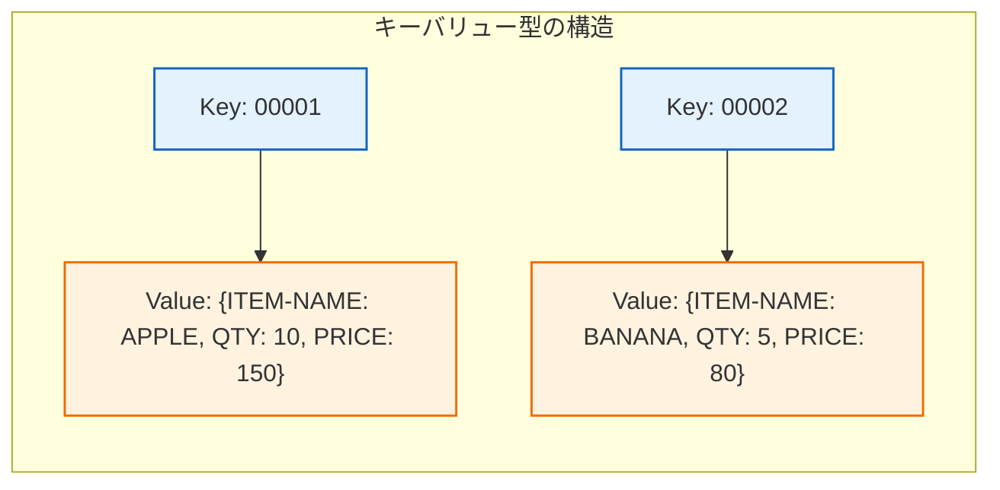

# 4.3 データベース｜NoSQL

> 基本情報技術者 科目A PART 4 > 4.3 いろいろなデータベース 對應｜最終更新 2026-10-03
> 回到 [[總覽]] ｜ 相關單詞：[[単語本#4. データベース|単語本 - データベース]]
> タグ：#FE/データベース #NoSQL

---

## 1. NoSQL とは

**中文**：NoSQL = "Not Only SQL"，指不使用傳統關聯式表格（SQL）的資料庫統稱。特點是**資料結構簡單**，能**高速搜尋海量資料**，適合處理非結構化數據（JSON、圖像、日誌等）。
**日文**：NoSQL（Not Only SQL）は、従来のリレーショナルデータベース（SQL）を使わないデータベースの総称。データ構造が単純で、膨大なデータを高速に検索できる。

---

## 2. NoSQL 的4種類型

| 類型 | 中文 | 日文 | 用途 |
|---|---|---|---|
| **キーバリュー型** | Key-Value 型 | キーバリュー型 | 用最簡單的 Key→Value 配對，高速讀寫 |
| **ドキュメント型** | 文件型 | ドキュメント型 | 以 JSON/BSON 格式保存半結構化數據 |
| **カラム型** | 列型 | カラム型 | 按列保存，適合大量數據分析 |
| **グラフ型** | 圖型 | グラフ型 | 按節點+關係保存，適合社交網絡 |

---

## 3. キーバリュー型（Key-Value Store）

**中文**：把「識別用的 Key」和「保存的 Value」成一對來管理，像字典一樣。Key 是唯一識別碼，Value 是對應的資料。結構最簡單、速度最快，但無法做複雜查詢。
**日文**：データを識別するための「Key」と保存データの「Value」をセットで管理する。辞書のようにシンプルで高速だが、複雑な検索はできない。

> **中文**：Key 像字典的單字，Value 像解釋。給 Key 就找到 Value，但不能反過來查。
> **日文**：Keyが辞書の単語、Valueが説明。KeyからValueは即座に引けるが、ValueからKeyは検索できない。

---

## 4. SQL vs NoSQL 對比

|  | SQL（リレーショナルDB） | NoSQL |
|---|---|---|
| 資料結構 | 表格（行+列），結構嚴格 | 結構簡單（Key-Value/文件/列/圖） |
| 查詢 | 複雜查詢（JOIN、GROUP BY） | 簡單查詢（Key 直接取） |
| 擴展性 | 垂直擴展（升級硬體） | 水平擴展（加伺服器） |
| 適用 | 交易、財務等需一致性 | 大量非結構化數據、高速讀寫 |

---

## 5. 重要度まとめ

- NoSQL = Not Only SQL，資料結構簡單、高速搜尋海量數據
- 4種類型：キーバリュー / ドキュメント / カラム / グラフ
- キーバリュー型 = Key + Value 配對，像字典
- SQL 強在複雜查詢和一致性，NoSQL 強在速度和擴展性

*出典：科目A PART 4 > 4.3 いろいろなデータベース*
