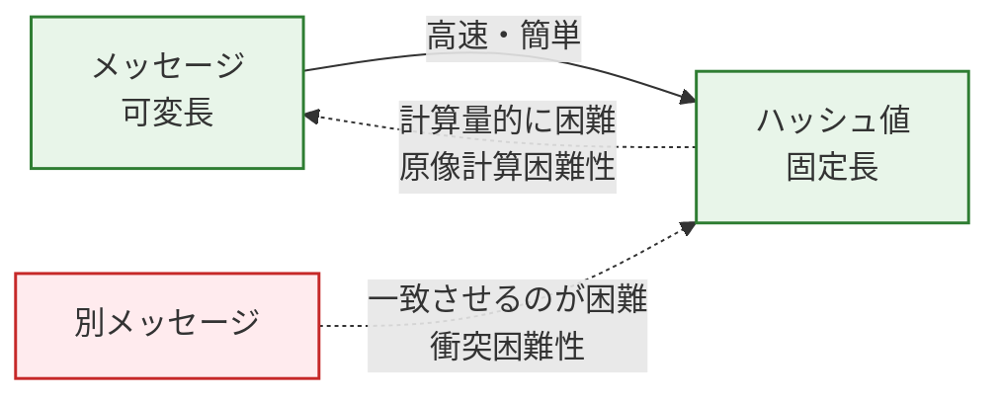

# 6.1 セキュリティ｜認証と暗号・ハッシュ

> 基本情報技術者 科目A PART 6 > 6.1 情報セキュリティの概要 對應｜最終更新 2026-10-03
> 回到 [[總覽]] ｜ 相關單詞：[[単語本#6. セキュリティ|単語本 - セキュリティ]]
> タグ：#FE/セキュリティ #認証 #ハッシュ #暗号

---

## 1. 暗号学的ハッシュ関数とは

**中文**：把任意長度的訊息轉成固定長度雜湊值的函數。重點是單向：正向計算很快，逆向還原幾乎不可能。
**日文**：可変長のメッセージを固定長のハッシュ値に変換する関数。正方向の計算は高速だが、逆方向の復元は計算量的に困難（一方方向性）。

---

## 2. 3つの安全性質（令和7年7月免除 問28）

| 性質 | 中文 | 日文 | 對應選項 |
|---|---|---|---|
| **原像計算困難性**（一方向性） | 給定雜湊值，找不到能產生它的原始訊息 | 与えられたハッシュ値を出力するメッセージを見つけることが計算量的に困難 | **ア ★正解** |
| **可変長→固定長** | 任意長輸入都產生固定長輸出（基本性質，非安全要求） | 可変長メッセージから固定長ハッシュ値を生成できる | イ（基本性質） |
| **衝突困難性** | 找不到兩個不同訊息產生相同雜湊值 | 異なる二つのメッセージでハッシュ値が一致するものを見つけることが困難 | ウ（另一種安全要求） |
| **耐タンパー性** | 硬體層面防止外部非法觀測與改竄（與雜湊無關的干擾項） | 処理メカニズムへの不正な観測や改変を防御できる | エ（無關） |

> **中文**：題目問「原像計算困難性，也就是一方向性」→ 直接對應ア。「給定雜湊值→找訊息很困難」就是一方向的定義。
> **日文**：「原像計算困難性、つまり一方向性」と問われたら、「ハッシュ値→メッセージが困難」のア。即答。

---

## 3. 2要素認証（令和8年度 問9）

**中文**：2要素認証必須組合「不同種類」的兩種要素。三要素是：知識（你知道的）、所持（你擁有的）、生体（你本身就是的）。同一種類用兩次不算。
**日文**：2要素認証は「異なる種類」の2要素の組合せが必要。3要素は知識（知っているもの）・所持（持っているもの）・生体（本人そのもの）。同じ種類を2つ使っても2要素にならない。

| 要素 | 中文 | 日文 | 例 |
|---|---|---|---|
| **知識** | 你知道的：密碼、秘密問題答案 | 知っているもの：パスワード、秘密の質問の答え | エは知識×2 → × |
| **所持** | 你擁有的：客戶端憑證、硬體權杖 | 持っているもの：クライアント証明書、ハードウェアトークン | アは所持×2 → × |
| **生体** | 你本身：靜脈、指紋 | 本人そのもの：静脈、指紋 | イは生体×2 → × |

| 選項 | 組合 | 判定 |
|---|---|---|
| ア | クライアント証明書＋ハードウェアトークン（所持×2） | × 同一要素 |
| イ | 静脈＋指紋（生体×2） | × 同一要素 |
| **ウ ★** | **パスワード（知識）＋静脈（生体）** | **○ 2要素** |
| エ | パスワード＋秘密の質問（知識×2） | × 同一要素 |

> **中文**：先把每個選項標上要素種類，種類不同才是 2要素。只有ウ是「知識＋生体」。
> **日文**：各選択肢の要素種類を書き出すと、種類が異なるのはウ（知識＋生体）だけ。

---

## 4. 重要度まとめ

- 一方向性（原像計算困難性）：雜湊值→原始訊息，逆向不可能
- 可変長→固定長：雜湊函數的基本性質
- 衝突困難性：兩個不同訊息→同一雜湊值，找不到
- 耐タンパー性：硬體防竄改，與雜湊無關（干擾項）
- 2要素認証：知識・所持・生体中取「不同種類」兩種，同学種×2不算

*出典：令和7年7月免除 問28 / 令和8年度 問9*
